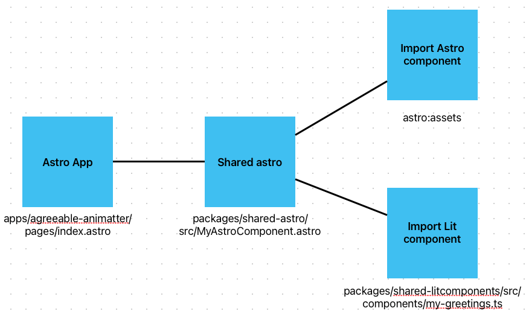

# Turborepo starter

## Error

In an Astro app if you inherit a package that has an Astro component in it.
If this component contains both a Lit component and an Astro import, an unrelated
error occurs. This is the error: `There was an uncaught error in the middle of the stream while rendering /.
TypeError: customElements.get(...) is not a constructor`.

### Notes

- Server side rendering `output: server` has to be active for this error to occur.
- Both the Astro import and the Lit import are required for the error to occur.

## Inheritance that causes the problem

## Installation

Use `pnpm` to install the dependencies

`pnpm i`

## To reproduce the error

`pnpm build` and `pnpm preview`, after this open the url from the webserver.
